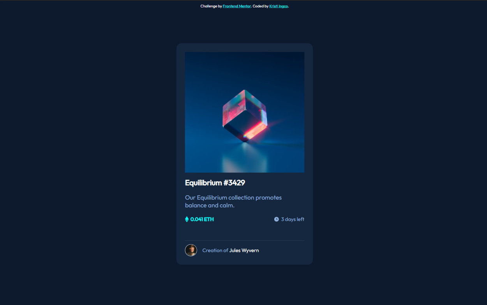

# Frontend Mentor - NFT preview card component solution

This is a solution to the [NFT preview card component challenge on Frontend Mentor](https://www.frontendmentor.io/challenges/nft-preview-card-component-SbdUL_w0U). Frontend Mentor challenges help you improve your coding skills by building realistic projects. 

## Table of contents

- [Overview](#overview)
  - [The challenge](#the-challenge)
  - [Screenshot](#screenshot)
  - [Links](#links)
- [My process](#my-process)
  - [Built with](#built-with)
  - [What I learned](#what-i-learned)
  - [Continued development](#continued-development)
  - [Useful resources](#useful-resources)
- [Author](#author)
- [Acknowledgments](#acknowledgments)

## Overview

### The challenge

Users should be able to:

- View the optimal layout depending on their device's screen size
- See hover states for interactive elements

### Screenshot

### Links

- Solution URL: [https://www.frontendmentor.io/challenges/nft-preview-card-component-SbdUL_w0U/hub/nft-preview-card-component-challenge-hub-kK65dsh-h](https://www.frontendmentor.io/challenges/nft-preview-card-component-SbdUL_w0U/hub/nft-preview-card-component-challenge-hub-kK65dsh-h)
- Live Site URL: [https://kristiingco.github.io/preview-card-component/](https://kristiingco.github.io/preview-card-component/)

## My process

### Built with

- HTML5
- Sass CSS Pre-processor
- Flexbox
- Mobile-first workflow

### What I learned

- Integrating Sass! Learning what CSS pre-processors do as well as how to use it in the project was fun and interesting.
- Using Github Pages! I've only learned how to use Heroku and Netlify, and I always wanted to try different hosting sites to find one I would prefer using.

### Continued development

- Responsiveness. I definitely feel like I could improve on how to make optimal layouts for multiple devices using Flexbox.
- Using React. In future projects, I wish to use React from now on.
- Utilizing a CSS framework. I think it'd be interesting to use a CSS framework like Bootstrap and modify it to match the challenge.

### Useful resources

- [Sass Basics](https://sass-lang.com/guide) - The official documentation for Sass. Very simple and facilitates the learning process of using Sass for projects.
- [Frontend Mentor trusted hosting providers](https://medium.com/frontend-mentor/frontend-mentor-trusted-hosting-providers-bf000dfebe) - This helped me find out different free hosting providers to try out.
- [Using CSS transitions](https://developer.mozilla.org/en-US/docs/Web/CSS/CSS_Transitions/Using_CSS_transitions) - This site is a great reference for CSS transitions.

## Author

- Website - [Kristi Ingco](https://kristitxt.netlify.app)
- Frontend Mentor - [kristiingco](https://www.frontendmentor.io/profile/kristiingco)
- LinkedIn - [kristianaingco](https://www.linkedin.com/in/kristianaingco/)
- Github - [kristiingco](https://www.github.com/kristiingco)

## Acknowledgments

I've recently joined Frontend Mentor and had a warm welcome from the people at the Slack channel! Thank you to the community for being so encouraging and I look forward to growing with you all!